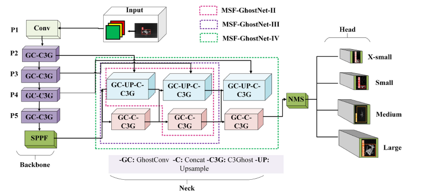

# 🚀 MSF-GhostNet: Computationally Efficient YOLO for Detecting Drones in Low-Light Conditions

[](https://ieeexplore.ieee.org/document/10818706)  
[](https://app.roboflow.com/tfnet-night-vision/mul/4)  
[](https://creativecommons.org/licenses/by/4.0/)  

---

## 📌 Overview  
Uncrewed Aerial Vehicles (UAVs) are widely used in surveillance, logistics, and agriculture. However, **detecting drones at night or in low-light conditions** is extremely challenging due to:  
- Small object sizes 🕊️  
- High-speed movement 🛩️  
- Complex backgrounds 🌃  

**MSF-GhostNet** is our novel, computationally efficient **YOLOv5-based architecture** optimized with:  
- 🧠 **GhostConv & C3Ghost modules** (reduce redundancy, faster inference)  
- 🔗 **Multiscale feature maps** (better detection of small, medium, and large UAVs)  
- ⚡ **AutoAnchor & AutoBatch mechanisms** (adaptive to GPU/CPU memory)  
- 🎯 **Superior precision, recall, and F1** compared to GhostNet-YOLOv5  

📊 **Key Results**:  
- **+5.3% Recall**, **+3.7% F1-score** over GhostNet-YOLOv5  
- **3.1% fewer parameters** & **4.1% smaller model size**  
- Robust detection in **fog, urban, cloudy, and low-light environments**  

---

## 🏗️ Architecture  
<p align="center">
  
</p>

- **Backbone**: YOLOv5 + Ghost Modules  
- **Neck Variants**:  
  - MSF-II → P3-P4 (Small & Medium)  
  - MSF-III → P3-P4-P5 (Small, Medium, Large)  
  - MSF-IV → P2-P3-P4-P5 (X-Small to Large)  
- **Head**: Modified YOLOv5 detection layers  

---

## 📂 Dataset  
We created a **custom IR dataset** with **8362 images** across 4 classes:  
- 🕊️ Birds  
- 🚁 Helicopters  
- ✈️ Planes  
- 🚀 Drones  

✔️ Balanced across **varied backgrounds**: clear sky, foggy, cloudy, urban, portable, and obscure.  
✔️ Pre-annotated in **YOLO Darknet TXT format**.  
✔️ Available on [Roboflow](https://app.roboflow.com/tfnet-night-vision/mul/4).  

---

## ⚙️ Installation  

```bash
# Clone repo
git clone https://github.com/ZeeshanKaleem/MSF-GhostNet.git
cd MSF-GhostNet

# Create environment
conda create -n msf-ghostnet python=3.9 -y
conda activate msf-ghostnet

# Install requirements
pip install -r requirements.txt
```

---

## 🚀 Training  

```bash
# Train MSF-GhostNet (example: MSF-III)
python train.py   --data data/drone.yaml   --cfg models/msf-ghostnet-iii.yaml   --weights ''   --batch-size 32   --epochs 600   --img 416
```

---

## 🔍 Inference  

```bash
# Run detection
python detect.py   --weights runs/train/msf-ghostnet-iii/weights/best.pt   --source data/samples/   --img 416
```

Outputs will be saved in `runs/detect/`.  

---

## 📊 Results  

| Model          | Precision | Recall | F1-score | mAP@0.5 | Params | Size |
|----------------|-----------|--------|----------|---------|--------|------|
| GhostNet-YOLOv5 | 97.9%    | 90.1%  | 93.0%    | 97.2%   | 6.7M   | 14.4MB |
| **MSF-II**     | 92.7%    | 95.5%  | 94.1%    | 97.7%   | 2.8M   | 5.9MB |
| **MSF-III**    | 99.2%    | 96.7%  | 97.9%    | 99.5%   | 3.7M   | 10.1MB |
| **MSF-IV**     | 99.2%    | 98.4%  | 98.8%    | 99.6%   | 6.5M   | 13.6MB |

---

## 🎯 Applications  
- 🛰️ **Surveillance & Security** → Detect unauthorized UAVs  
- 🚚 **Logistics** → Safe UAV-based delivery systems  
- 🌾 **Agriculture** → Crop monitoring at night  
- 🛡️ **Military & Defense** → Counter-drone operations  

---

## 📜 Citation  

If you use this work, please cite:  

```bibtex
@ARTICLE{10818706,
  author={Misbah, Maham and Khan, Misha Urooj and Kaleem, Zeeshan and Muqaibel, Ali and Alam, Muhamad Zeshan and Liu, Ran and Yuen, Chau},
  journal={IEEE Journal of Selected Topics in Applied Earth Observations and Remote Sensing}, 
  title={MSF-GhostNet: Computationally Efficient YOLO for Detecting Drones in Low-Light Conditions}, 
  year={2025},
  volume={18},
  number={},
  pages={3840-3851},
  doi={10.1109/JSTARS.2024.3524379}}
```

---

## 🧑‍💻 Contributors  
- Maham Misbah  
- Misha Urooj Khan  
- Zeeshan Kaleem  
- Ali Muqaibel  
- Muhamad Zeshan Alam  
- Ran Liu  
- Chau Yuen  

---

## 📖 License  
This project is released under the [Creative Commons Attribution 4.0 License](https://creativecommons.org/licenses/by/4.0/).  
